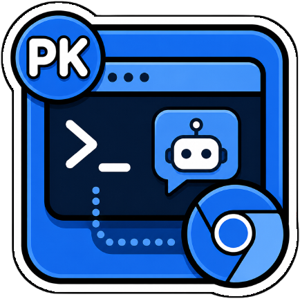

# Codex Browser Agent



[🇫🇷 FR](README.md) · [🇬🇧 EN](README_en.md)

Extension Chrome MV3 avec panneau latéral qui envoie des requêtes en langage naturel à un bridge local utilisant Codex CLI pour automatiser les actions du navigateur.

## ✅ Fonctionnalités

- Panneau latéral Chrome intégré pour les requêtes en langage naturel
- Bridge HTTP local communiquant avec Codex CLI
- Capture DOM + screenshot pour l'analyse de page
- Orchestration jusqu'à 8 étapes de raisonnement par requête
- Support des sites complexes (Gmail, applications web)
- Configuration flexible via variables d'environnement

## 🧠 Utilisation

### Démarrer le bridge

```bash
# Par défaut (Codex)
npm start

# Ou choisir un provider spécifique
npm run start:codex
npm run start:gemini
npm run start:glm
```

Variables d'environnement optionnelles :

```bash
# Bridge
BRIDGE_HOST=127.0.0.1
BRIDGE_PORT=7823

# AI CLI Provider (codex, gemini, glm)
AI_CLI=codex
AI_MODEL=gpt-5.4

# Optionnels : binaires personnalisés
CODEX_BIN=codex
GEMINI_BIN=gemini
GLM_BIN=glm
```

### Charger l'extension Chrome

1. Ouvrir `chrome://extensions`
2. Activer le **Mode développeur**
3. Cliquer sur **Charger l'extension non empaquetée**
4. Sélectionner le dossier `extension/`
5. Épingler l'extension pour un accès rapide
6. Cliquer sur l'extension pour ouvrir le panneau latéral

### Exemples de requêtes

- `Lit les 5 premiers fils de discussion visibles et donne-moi un résumé.`
- `Ouvre le premier résultat sur cette page.`
- `Défile jusqu'à trouver les tarifs, puis résume-les.`
- `Clique sur le bouton "S'inscrire" et remplis le formulaire.`

## 🧠 Architecture

```
extension/
├── manifest.json           # Configuration MV3
├── background.js           # Service worker
├── content-script.js       # Analyse DOM
├── sidepanel.js/html/css   # Interface utilisateur

bridge/
├── server.mjs              # Serveur HTTP local
├── agent-schema.json       # Schéma de configuration
```

## ⚙️ Configuration

Le bridge écoute par défaut sur `127.0.0.1:7823` (localhost uniquement).

### Providers AI

Le bridge supporte plusieurs CLI :

| Provider | Variable AI_CLI | Variable AI_MODEL | Binaire par défaut |
|----------|-----------------|-------------------|-------------------|
| Codex    | `codex`         | `gpt-5.4`         | `codex`           |
| Gemini   | `gemini`        | `gemini-2.0-flash`| `gemini`          |
| GLM      | `glm`           | `glm-4.7`         | `glm`             |

**Exemples d'utilisation :**

```bash
# Avec Codex (défaut)
AI_CLI=codex AI_MODEL=gpt-5.4 npm run start:bridge

# Avec Gemini
AI_CLI=gemini AI_MODEL=gemini-2.0-flash npm run start:bridge

# Avec GLM
AI_CLI=glm AI_MODEL=glm-4.7 npm run start:bridge
```

### Variables disponibles

- `BRIDGE_HOST` : Hôte d'écoute (défaut: 127.0.0.1)
- `BRIDGE_PORT` : Port d'écoute (défaut: 7823)
- `AI_CLI` : Provider AI (`codex`, `gemini`, `glm`) - défaut: `codex`
- `AI_MODEL` : Modèle à utiliser
- `CODEX_BIN`, `GEMINI_BIN`, `GLM_BIN` : Chemin vers les binaires

## ⚠️ Limitations

- Fonctionne uniquement sur les pages où les content scripts sont autorisés
- Utilise un snapshot DOM compact + screenshot, pas une automatisation complète du navigateur
- Le panneau latéral orchestre jusqu'à 8 étapes de raisonnement par requête
- Gmail et autres applications complexes peuvent nécessiter des itérations pour une fiabilité optimale

## 🧾 Changelog

### 0.2.0
- Support multi-providers : Codex, Gemini, GLM
- Variables d'environnement unifiées (AI_CLI, AI_MODEL)
- Scripts npm pour chaque provider
- Refactorisation de la configuration

### 0.1.0
- Version initiale
- Support du panneau latéral Chrome
- Bridge HTTP local avec Codex CLI
- Capture DOM + screenshot
- Orchestration multi-étapes

## 🔗 Liens

- [EN README](README_en.md)
- Codex CLI : https://github.com/anthropics/codex
- Issue Tracker : https://github.com/votre-username/macos-browser-agent/issues
